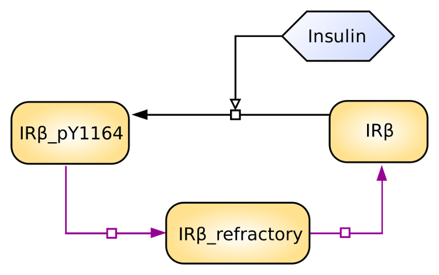
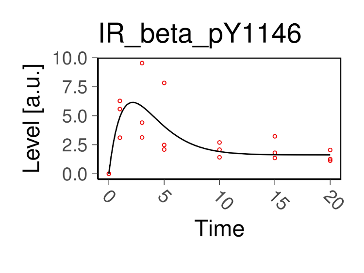

## Quick examples

Here we illustrate how to use SBpipe to simulate and estimate the parameters of a minimal model of the
insulin receptor.



To run this example Miniconda3 ([https://conda.io/miniconda.html](https://conda.io/miniconda.html)) must be installed.
From a GNU/Linux shell, run the following commands:
```
# install sbpipe and its dependencies (including sbpiper)
conda install sbpipe -c pdp10 -c conda-forge -c fbergmann -c defaults

# install LaTeX
conda install -c pkgw/label/superseded texlive-core=20160520 texlive-selected=20160715

# install R dependencies (second example)
conda install r-desolve r-minpack.lm -c conda-forge

# create a project using the command:
sbpipe -c quick_example
```

### Model simulation
This example should complete within 1 minute. For this example, the mathematical model is coded in Python. The following model file must be saved in `quick_example/Models/insulin_receptor.py`.
```
# insulin_receptor.py

import numpy as np
from scipy.integrate import odeint
import pandas as pd
import sys

# Retrieve the report file name (necessary for stochastic simulations)
report_filename = "insulin_receptor.csv"
if len(sys.argv) > 1:
    report_filename = sys.argv[1]


# Model definition
# ---------------------------------------------
def insulin_receptor(y, t, inp, p):
    dy0 = - p[0] * y[0] * inp[0] + p[2] * y[2]
    dy1 = + p[0] * y[0] * inp[0] - p[1] * y[1]
    dy2 = + p[1] * y[1] - p[2] * y[2]
    return [dy0, dy1, dy2]

# input
inp = [1]
# Parameters
p = [0.475519, 0.471947, 0.0578119]
# a tuple for the arguments (see odeint syntax)
config = (inp, p)

# initial value
y0 = np.array([16.5607, 0, 0])

# vector of time steps
time = np.linspace(0.0, 20.0, 100)

# simulate the model
y = odeint(insulin_receptor, y0=y0, t=time, args=config)
# ---------------------------------------------


# Make the data frame
d = {'time': pd.Series(time),
     'IR_beta': pd.Series(y[:, 0]),
     'IR_beta_pY1146': pd.Series(y[:, 1]),
     'IR_beta_refractory': pd.Series(y[:, 2])}
df = pd.DataFrame(d)

# Write the output. The output file must be the model name with csv or txt extension.
# Fields must be separated by TAB, and row indexes must be discarded.
df.to_csv(report_filename, sep='\t', index=False, encoding='utf-8')
```

We also add a data set file to overlap the model simulation with the experimental data. This file must be saved in `quick_example/Models/insulin_receptor_dataset.csv`. Fields can be separated by a TAB or a comma.
```
Time,IR_beta_pY1146
0,0
1,3.11
3,3.13
5,2.48
10,1.42
15,1.36
20,1.13
30,1.45
45,0.67
60,0.61
120,0.52
0,0
1,5.58
3,4.41
5,2.09
10,2.08
15,1.81
20,1.26
30,0.75
45,1.56
60,2.32
120,1.94
0,0
1,6.28
3,9.54
5,7.83
10,2.7
15,3.23
20,2.05
30,2.34
45,2.32
60,1.51
120,2.23
```

We then need a configuration file for SBpipe, which must be saved in `quick_example/insulin_receptor.yaml`
```
# insulin_receptor.yaml

generate_data: True
analyse_data: True
generate_report: True
project_dir: "."
simulator: "Python"
model: "insulin_receptor.py"
cluster: "local"
local_cpus: 4
runs: 1
exp_dataset: "insulin_receptor_dataset.csv"
plot_exp_dataset: True
exp_dataset_alpha: 1.0
xaxis_label: "Time"
yaxis_label: "Level [a.u.]"
```

Finally, SBpipe can execute the model as follows:
```
cd quick_example
sbpipe -s insulin_receptor.yaml
```

The folder `quick_example/Results/insulin_receptor` is now populated with the model simulation, plots, and a PDF report.




### Model parameter estimation
This example should complete within 5 minutes. For this example, the mathematical model is coded in R and a Python wrapper is used to invoke this model.
The model and its wrapper file must be saved in `quick_example/Models/insulin_receptor_param_estim.r` and `quick_example/Models/insulin_receptor_param_estim.py`. This model uses the data set in the previous example.
```
# insulin_receptor_param_estim.r

library(reshape2)
library(deSolve)
library(minpack.lm)

# get the report file name
args <- commandArgs(trailingOnly=TRUE)
report_filename  <-  "insulin_receptor_param_estim.csv"
if(length(args) > 0) {
  report_filename <- args[1]
}

# retrieve the folder of this file to load the data set file name.
args <- commandArgs(trailingOnly=FALSE)
SBPIPE_R <- normalizePath(dirname(sub("^--file=", "", args[grep("^--file=", args)])))

# load concentration data
df <- read.table(file.path(SBPIPE_R,'insulin_receptor_dataset.csv'), header=TRUE, sep=',')
colnames(df) <- c("time", "B")

# mathematical model
insulin_receptor <- function(t,x,parms){
  # t: time
  # x: initial concentrations
  # parms: kinetic rate constants and the insulin input
  insulin <- 1
  with(as.list(c(parms, x)), {
      dA <- -k1*A*insulin + k3*C
      dB <- k1*A*insulin - k2*B
      dC <- k2*B - k3*C
      res <- c(dA, dB, dC)
      list(res)
  })
}


# residual function
rf <- function(parms){
  # inital concentration
  cinit <- c(A=16.5607,B=0,C=0)
  # time points
  t <- seq(0,120,1)
  # parameters from the parameter estimation routine
  k1 <- parms[1]
  k2 <- parms[2]
  k3 <- parms[3]
  # solve ODE for a given set of parameters
  out <- ode(y=cinit,times=t,func=insulin_receptor,
             parms=list(k1=k1,k2=k2,k3=k3),method="ode45")

  outdf <- data.frame(out)
  # filter the column we have data for
  outdf <- outdf[ , c("time", "B")]
  # Filter data that contains time points where data is available
  outdf <- outdf[outdf$time %in% df$time,]
  # Evaluate predicted vs experimental residual
  preddf <- melt(outdf,id.var="time",variable.name="species",value.name="conc")
  expdf <- melt(df,id.var="time",variable.name="species",value.name="conc")
  ssqres <- sqrt((expdf$conc-preddf$conc)^2)

  # return predicted vs experimental residual
  return(ssqres)
}

# parameter fitting using Levenberg-Marquardt nonlinear least squares algorithm
# initial guess for parameters
parms <- runif(3, 0.001, 1)
names(parms) <- c("k1", "k2", "k3")
tc <- textConnection("eval_functs","w")
sink(tc)
fitval <- nls.lm(par=parms,
                 lower=rep(0.001,3), upper=rep(1,3),
                 fn=rf,
                 control=nls.lm.control(nprint=1, maxiter=100))
sink()
close(tc)

# create the report containing the evaluated functions
report <- NULL;
for (eval_fun in eval_functs) {
  items <- strsplit(eval_fun, ",")[[1]]
  rss <- items[2]
  rss <- gsub("[[:space:]]", "", rss)
  rss <- strsplit(rss, "=")[[1]]
  rss <- rss[2]
  estim.parms <- items[3]
  estim.parms <- strsplit(estim.parms, "=")[[1]]
  estim.parms <- strsplit(trimws(estim.parms[[2]]), "\\s+")[[1]]
  rbind(report, c(rss, estim.parms)) -> report
}
report <- data.frame(report)
names(report) <- c("rss", names(parms))

# write the output
write.table(report, file=report_filename, sep="\t", row.names=FALSE, quote=FALSE)
```

```
# insulin_receptor_param_estim.py

# This is a Python wrapper used to run an R model. The R model receives the report_filename as input
# and must add the results to it.

import os
import sys
import subprocess
import shlex

# Retrieve the report file name
report_filename = "insulin_receptor_param_estim.csv"
if len(sys.argv) > 1:
    report_filename = sys.argv[1]

command = 'Rscript --vanilla ' + os.path.join(os.path.dirname(__file__), 'insulin_receptor_param_estim.r') + \
          ' ' + report_filename

# we replace \\ with / otherwise subprocess complains on windows systems.
command = command.replace('\\', '\\\\')

# Block until command is finished
subprocess.call(shlex.split(command))
```

We then need a configuration file for SBpipe, which must be saved in `quick_example/insulin_receptor_param_estim.yaml`
```
# insulin_receptor_param_estim.yaml

generate_data: True
analyse_data: True
generate_report: True
project_dir: "."
simulator: "Python"
model: "insulin_receptor_param_estim.py"
cluster: "local"
local_cpus: 7
round: 1
runs: 50
best_fits_percent: 75
data_point_num: 33
plot_2d_66cl_corr: True
plot_2d_95cl_corr: True
plot_2d_99cl_corr: True
logspace: False
scientific_notation: True
```

Finally, SBpipe can execute the model as follows:
```
cd quick_example
sbpipe -e insulin_receptor_param_estim.yaml
```

The folder `quick_example/Results/insulin_receptor_param_estim` is now populated with the model simulation, plots, and a PDF report.

